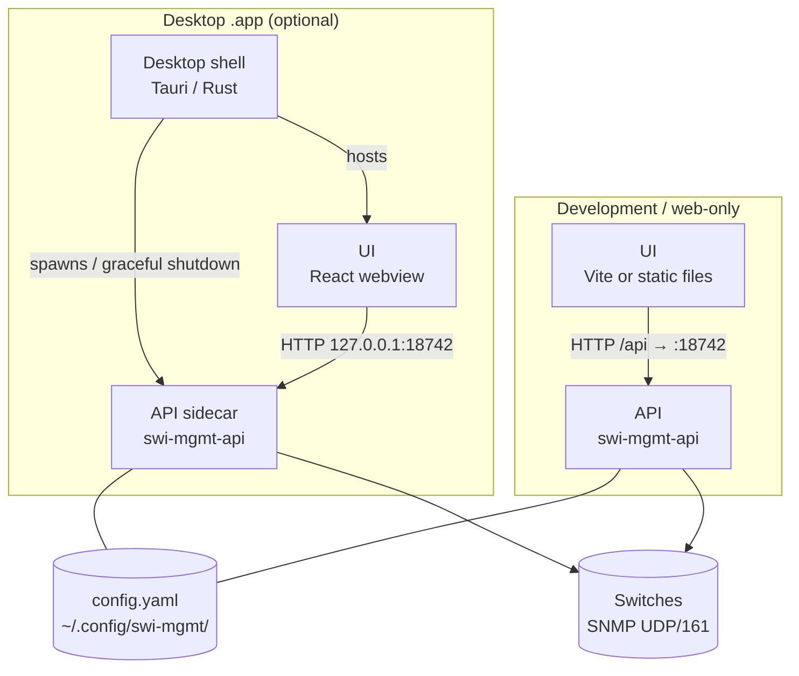
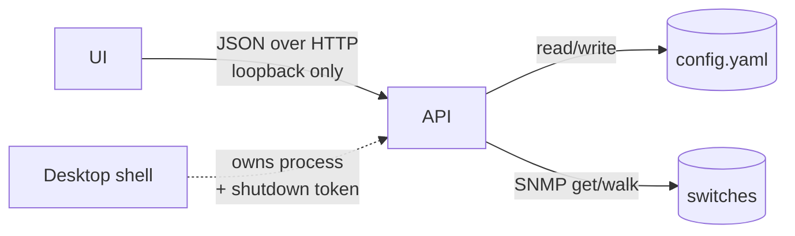
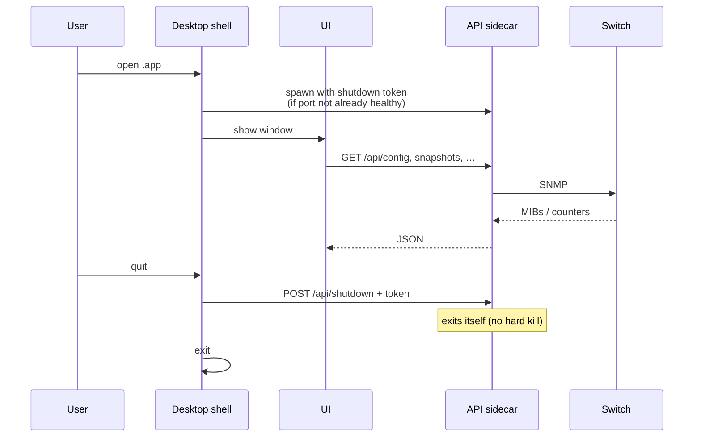

# SWI-MGMT

Standalone app to **monitor and inspect** network switches over SNMP.

## Features

- **Read-only SNMP** — SNMPv1, v2c, and v3 (USM); community / credentials stay on your machine
- **Front panel** — Visual port layout with link / VLAN cues
- **Ports table** — Admin/oper state, speed, media, PoE (when reported), traffic rates
- **VLAN list & matrix** — Session-wide VLANs with untagged/tagged port counts and a port×VLAN grid
- **Live monitoring** — Continuous polling with traffic bars and VLAN colors
- **Fast mode** — Lighter SNMP polls for snappier live refresh (structure cached)
- **Network scan** — Discover SNMP devices on a subnet (defaults to local /24)
- **Scenarios** — Export / import switch inventory + settings as JSON
- **Modular drivers** — Registry-based vendors; includes HPE/Aruba Instant On 1930 & 1960, TP-Link JetStream SG2424, plus generic Q-BRIDGE
- **Desktop app** — Optional Tauri `.app` with bundled API sidecar (macOS)

Persisted config (switches, communities, v3 keys, preferences) is stored only at:

```text
~/.config/swi-mgmt/config.yaml
```

That file is **not** part of this repository. Do not commit real inventories or community strings.

## Requirements

- Python 3.11+
- Node.js 18+ (web UI / desktop build)
- Rust toolchain (Tauri desktop build only)
- Network access to switches (UDP/161; ICMP helpful for scan)

## Install

```bash
cd swi-mgmt
python -m venv .venv
source .venv/bin/activate
pip install -e .
npm install
```

## Run options

### 1. API + web UI (development)

```bash
npm run dev
# or separately:
swi-mgmt-api          # http://127.0.0.1:18742
npm run dev:web       # http://localhost:1420
```

Open http://localhost:1420 — Vite proxies `/api` to the backend.

### 2. Web-only (single process)

```bash
npm run build:web
swi-mgmt-api
```

Open http://127.0.0.1:18742

### 3. Desktop app (Tauri)

Development:

```bash
npm run tauri:dev
```

Production build (PyInstaller API sidecar + `.app`):

```bash
pip install -e ".[dev]"
npm run tauri:build
```

Artifacts appear under `src-tauri/target/release/bundle/`.

If macOS blocks a copied `.app` on first open:

```bash
xattr -dr com.apple.quarantine path/to/SWI-MGMT.app
```

Prefer `/Applications`. Running the `.app` from `~/Documents` can trigger a macOS Documents permission prompt because of the bundle path; the app does **not** need Documents access for normal use.

App / favicon art is the lit (green) RJ45 from the front-panel view (`assets/app-icon.svg`). Regenerate with `npm run icons`.

## Usage

1. **Add a switch** — Host, community (or SNMPv3 user/keys), optional driver
2. **Scan** — Discover devices on your subnet; import selected hosts
3. **Inspect** — Front Panel, Ports, VLAN List, VLAN Matrix
4. **Live** — Toggle continuous polling; adjust interval as needed
5. **Session VLANs** — Click a VLAN to filter/highlight; click again to clear
6. **Scenarios** — Export or import inventory JSON for shows / backups

## Switch setup examples

### HPE/Aruba Instant On 1930 / 1960

Enable SNMP in the switch’s **local web UI** or the Instant On mobile/cloud management app (System / SNMP), and set a dedicated read-only community — not a guessable shared string.

### TP-Link JetStream SG2424 / T1600G-28TS

Enable SNMP v2c (or v3) in the web UI or CLI and allow Q-BRIDGE / Bridge MIB access from the monitoring host.

## Architecture

SWI-MGMT is three cooperating pieces: a **UI**, an **API** (the “brain”), and optionally a **desktop shell** that starts/stops that API as a sidecar. The UI never talks SNMP directly.

### Components

| Component | What it is | Responsibility |
|-----------|------------|----------------|
| **UI** | React app (`frontend/`) | Screens, filters, live polling UX. Calls HTTP `/api/*` only. |
| **API** (`swi-mgmt-api`) | FastAPI + SNMP stack (`src/swi_mgmt/`) | Config, sessions, scans, snapshots, drivers. Owns SNMP to switches. |
| **Desktop shell** | Tauri / Rust (`src-tauri/`) | Native window; embeds the UI; spawns the API as a **sidecar** process. |
| **Config file** | `~/.config/swi-mgmt/config.yaml` | Persisted inventory & settings (outside the repo). |
| **Switches** | Network devices | SNMP agents (UDP/161). Read-only from this app’s point of view. |

**Sidecar** means: the API binary is packaged next to the `.app` and launched as a child process. It is the same FastAPI server you run with `swi-mgmt-api` in development — not a second protocol stack.



### Who talks to whom



- **UI → API:** all product data (switches, snapshots, scan, scenarios, highlight). In the `.app`, the UI calls `http://127.0.0.1:18742/api/...`. In Vite dev, `/api` is proxied to that same port.
- **Shell → API:** process lifecycle only. On launch, if nothing healthy is listening, the shell starts the sidecar with a one-time **shutdown token**. On quit, it asks *that* process to exit via `POST /api/shutdown` (token required). It does **not** kill a reused API started by `npm run dev` or another instance.
- **API → config / switches:** persistence and SNMP. The shell and UI never open `config.yaml` or SNMP sockets themselves.

### Run modes (same components, different packaging)

| Mode | UI process | API process | How they meet |
|------|------------|-------------|----------------|
| **`npm run dev`** | Vite (`localhost:1420`) | `swi-mgmt-api` (script-started) | Proxy `/api` → `:18742` |
| **Web-only** | Served by the API (built `frontend/dist`) | Single `swi-mgmt-api` | Same origin `/api` |
| **Desktop `.app`** | Tauri webview | Bundled sidecar (or reuse if already healthy) | UI → `127.0.0.1:18742` |



### Source layout

```
src/swi_mgmt/
├── snmp/          # Client, OIDs, portlist, scanner, v3
├── drivers/       # Vendor drivers (generic, hpe_aruba_1930/1960, tp_link_sg2424, …)
├── models/        # VlanInfo, PortStatus, SwitchSnapshot
├── services/      # fetch_snapshot, run_scan
├── session/       # Cross-switch VLAN registry
├── api/           # FastAPI backend (127.0.0.1:18742)
├── scenario.py    # Inventory export / import
└── config.py      # ~/.config/swi-mgmt/config.yaml

frontend/          # React + Vite UI
src-tauri/         # Tauri desktop shell + sidecar wiring
scripts/           # Dev helpers, PyInstaller / desktop build
```

### Adding a driver

Extend `GenericSnmpDriver` in `drivers/`, implement `matches()`, register in `drivers/registry.py`.

## SNMP OIDs (common)

| Data | OID |
|------|-----|
| System description | 1.3.6.1.2.1.1.1.0 |
| Interface status | 1.3.6.1.2.1.2.2.1.8 |
| Port PVID | 1.3.6.1.2.1.17.7.1.4.5.1.1 |
| VLAN egress ports | 1.3.6.1.2.1.17.7.1.4.2.1.4 |
| VLAN untagged ports | 1.3.6.1.2.1.17.7.1.4.2.1.5 |

## Security notes

- The API binds to **loopback** (`127.0.0.1`) by default.
- Desktop builds may enable a token-gated `POST /api/shutdown` so only the parent `.app` can stop the sidecar it started.
- Treat SNMP communities and v3 keys like passwords; keep them in `~/.config/swi-mgmt/` only.

## License

MIT — see [LICENSE](LICENSE).
